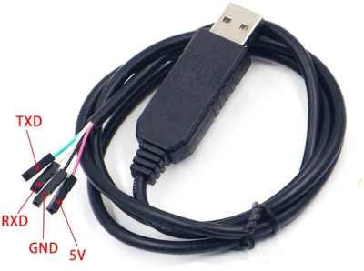
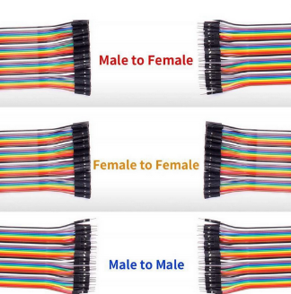
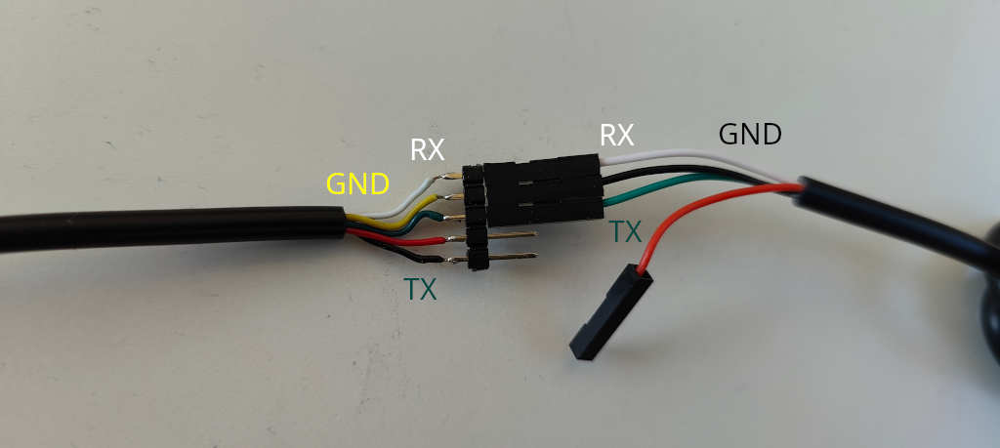
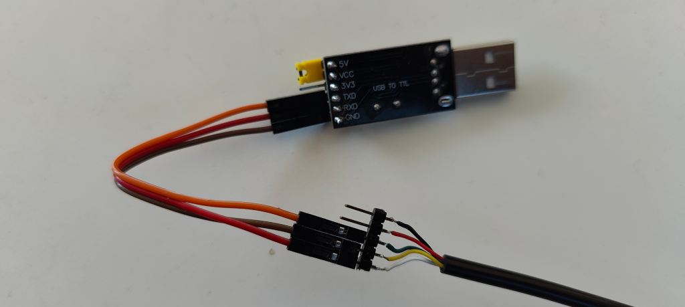
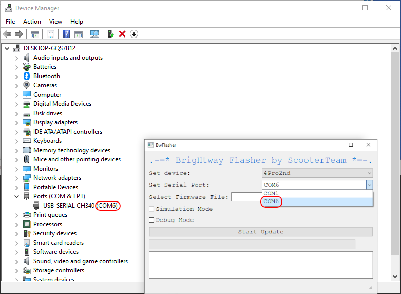
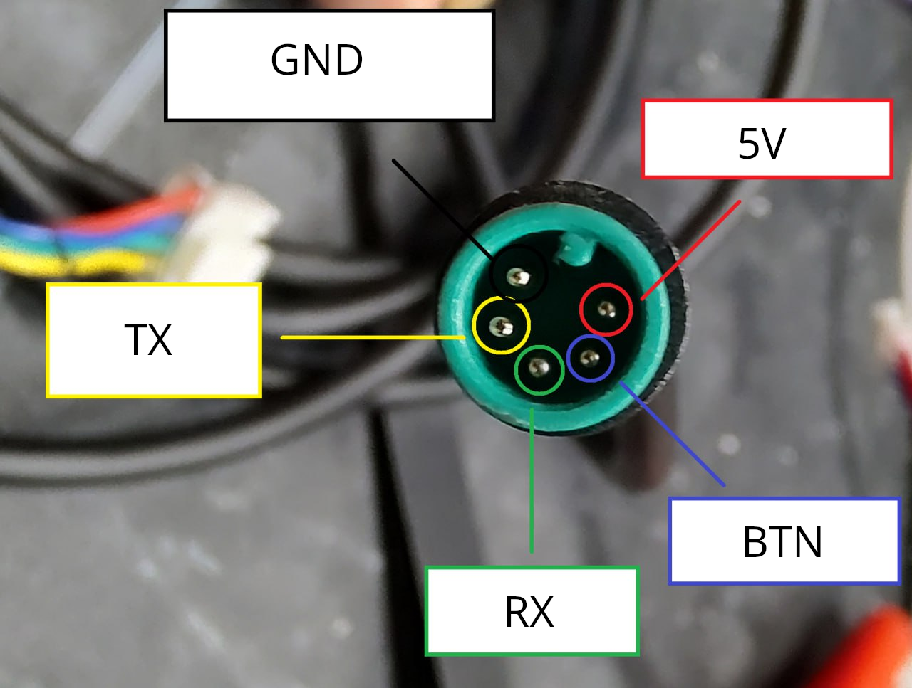

# 4 Pro 2nd gen Tuning
This guide has been created by ScooterTeam.

## Disclaimer
Take special note of each point before proceeding:

- Informational Purposes Only: The content of this guide is for educational and informational purposes only. It is not intended to promote or endorse the modification of scooter firmware or hardware, nor does it guarantee the safety, functionality, or legality of any modifications.
- Warranty Voidance: Modifying the scooter’s firmware or hardware, including using reverse-engineered tools, may void the manufacturer's warranty. Users should review their warranty terms before making any modifications.
- Assumption of Risk: Modifying scooter firmware or hardware can pose significant risks, including but not limited to voiding warranties, compromising safety, reducing functionality, or violating legal regulations. By following this guide, users assume full responsibility for any and all outcomes, including personal injury, property damage, or legal penalties.
- Legal Compliance: Users are solely responsible for ensuring that any modifications comply with applicable laws and regulations in their jurisdiction, including but not limited to those regarding speed limits, roadworthiness, and intellectual property.
- No Liability: The creators of this guide disclaim all liability for any direct, indirect, incidental, or consequential damages resulting from the use or misuse of the information or tools provided. By using this guide, users agree to release the authors from any legal claims or liabilities arising from their actions.

## Requirements
### Hardware
#### USB-to-serial (UART) adapter
The following UART adapters are known to work:

- CH340
- FT232RL
- PL2303HX

Not tested: CP2102

Recommendation: Buy an adapter with a cable attached to it, like shown in the image below. It will make your life a bit easier, since you won't have to buy additional DuPont wires to bridge pins.

#### Dashboard cable
To connect the USB adapter with the scooter a risk-free method is to use a replacement dashboard cable (female Julet type connector). You can buy a ready-to-use dashboard breakout cable with pin headers here: [eBay](https://www.ebay.de/itm/356316680470). This cable is guaranteed to fit, but you can look for other options as well.

Remark: Due to the tight pin spacing and small size of the dashboard connector, creating a DIY wiring solution is challenging and risks causing a short circuit between the pins. Alternate methods are possible, but require opening up the scooter (see [here](#alternate-methods-to-connect-the-uart-adapter)).

#### DuPont wires (optional)
If you have an UART adapter without an attached cable, you'll need a set of female-to-female DuPont wires. The wires should have 80-100cm length to reach the adapter end without tension. If you can't find female-to-female wires in that length, simply extend the wires with sets of male-to-female wires.

### Software
Download the BwFlasher standalone executable here: [BwFlasher](https://github.com/scooterteam/bw-flasher/releases/latest)

You can also run the tool locally from the BwFlasher source: [SourceCode](https://github.com/scooterteam/bw-flasher)

## Procedure

### Step 1. Prepare cable
Connect the UART adapter with the breakout [dashboard cable](#dashboard-cable). Either directly, if you have an adapter with an attached cable, or with DuPont wires otherwise.

Dashboard cable | UART adapter
-- | --
White | RX (white)
Yellow | GND (black)
Green | TX (green)
Red | /
Black | /

Note: The wire colors for the UART adapter can vary. Check back with the supplier which color is which.

##### A) UART adapter with attached cable

##### B) UART adapter + DuPont wires

### Step 2. Prepare patched firmware
1. Visit this site: [mi-fw-info](https://mi-fw-info.streamlit.app)
1. Download the **MCU firmware** update file for "4 Pro (2nd Gen)"
1. Visit this site: [bw-patcher](https://bw-patcher.streamlit.app)
1. Upload firmware update file downloaded before
1. Select "4pro2nd" and check the needed patches
1. Download patched firmware update file

### Step 3. Prepare flashing
1. Start BwFlasher tool
1. Check if the COM port is correctly set (see [here](#finding-out-the-com-port-number))
1. Select the patched firmware file

### Step 4. Turn on the scooter and start flashing
1. Remove the screws from the handlebar
1. Pull out the handlebar shaft
1. **Start the scooter** by pressing the ON button once
1. Unplug the dashboard cable (while the scooter is on!)
1. Plug in your adapter cable
1. Hit the "Start Update" button in BwFlasher

In BwFlasher, you should now see the progress bar advancing and updates appearing in the log. Once the progress reaches 100%, check the log for the message "Flashing complete". If you see this message: Congratulations, your scooter is now modified.

### Step 5. Assembly
1. Remove the adapter cable
2. Plug in the dashboard cable
3. Insert the handlebar shaft
4. Insert and tighten the screws

## Appendix

### Finding out the COM port number
On Windows: Open the Device Manager and look for "Ports (COM & LPT)". The UART adapter should show up there together with the COM port.

### Dashboard cable pinout

### Alternate methods to connect the UART adapter
Warning: Requires controller removal!

If you don't have / want to buy a replacement dashboard cable, one of the following methods might work out for you:

- Use a regular 5 pin JST connector, like a spare hall sensor cable, in place of the original connector: cut it in half, solder or crimp the wires and connect them to the UART adapter (@encryptize).
- Pull out the pins of the original connector, then take new wires, crimp them and insert them into the connector. Connect the other end of the wires to the UART adapter.
- Needle method (@turbojeet): Take household needles, cut off the wide thread ends and insert them into female dupont connectors. Stick those needles into the connector alongside the original pins / wires.
- Soldering wires directly to the PCB: Unfeasible in this case, because the contacts are difficult to reach because of conformal coating / silicon.
