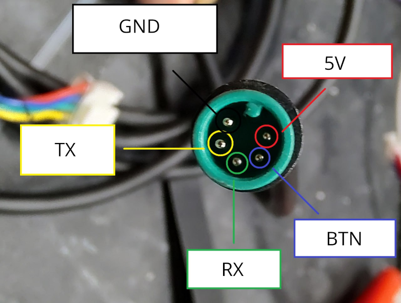
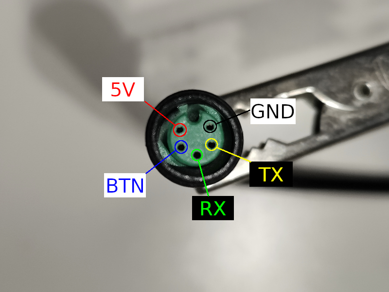

# Brightway Scooter Tuning Guide
This guide has been created by ScooterTeam.

## Quick Start Guide
1. Check if your scooter model is supported (see [Supported Models](#supported-models))
2. Read the [Safety Warning](#safety-warning) carefully
3. Get the required hardware (see [Hardware Requirements](#hardware-requirements))
4. Follow the step-by-step [Flashing Instructions](#flashing-instructions)

A comprehensive video tutorial explaining every step in great detail is available on [YouTube](https://youtu.be/fUWCeF0GpME).

## Supported Models

| Model           | Tested OK | Credits for testing |
|-----------------|-----------|---------------------|
| 3 Lite          | TBA       | TBA                 |
| 4               | ✅        | Ilkan0342567        |
| 4 Lite          | ✅        | Gianluxx            |
| 4 Pro 2nd Gen   | ✅        | encryptize          |
| 5               | ✅        | holow_rt            |
| 5 Max           | ✅        | Lenny5292           |
| 5 Pro           | ✅        | Krypz0n             |

> Note: If you own a model marked as TBA (To Be Announced), please be aware that the process hasn't been fully tested yet. You can help by testing and reporting your results.

## Safety Warning ⚠️
Before proceeding, please understand:

1. **Warranty**: This process will void your scooter's warranty
2. **Safety**: Incorrect modifications could affect your scooter's safety
3. **Legal**: Ensure your modifications comply with local laws
4. **Risk**: You are responsible for any damage or issues that may occur

> **Important**: This guide is provided solely for educational and research purposes. We do not endorse, recommend, or support any commercial activities related to scooter modification, including but not limited to: complete flashing kits, tuning services, modification services, or any other commercial products or services. Any modifications made to a scooter are done at the user's own risk and responsibility.

> For complete legal information, please read the [Full Disclaimer](#full-disclaimer) at the bottom of this guide.

## Hardware Requirements

### Step 1: Check Your Scooter's Connector Type
First, look at the table below to find your scooter model and its required connector type:

Model | Required Connector | Size | Notes
-- | -- | -- | --
3 Lite | Male | M7 |
4 | Male | M7 |
4 Lite | Male | M7 |
4 Pro 2nd Gen | Female | M7 |
5 | Female | M7 | Models manufactured in 2025 may use M6!
5 Max | Male | M7 |
5 Pro | Male | M7 |

> **What's the difference?**
> - Male connector: Has pins that stick out
> - Female connector: Has holes that the pins go into
> 
> You need to match your scooter's connector type exactly.

### Step 2: Get the Required Parts
You'll need these three main components:

#### 1. Dashboard Cable
This is the cable that connects your scooter to the computer. You have two options:

**Option A: Buy a Complete Cable Assembly (Recommended for Beginners)**
- This is the easiest option
- The cable should come with:
  - M7 5-pin Julet connector (matching your scooter's type)
  - Pre-attached DuPont headers
  - Proper wire colors and pinout documentation
- No soldering or special tools required
- Look for these specifications:
  - M7 size (not M6 or M8)
  - 5-pin configuration
  - Correct connector type (male/female)
  - Clear pinout documentation
- Example search results (for reference only):
  - Female connector example: [M7 5-pin Julet Female Dashboard Cable](https://www.ebay.com/itm/356681290474)
  - Male connector example: [M7 5-pin Julet Male Dashboard Cable](https://www.ebay.com/itm/356888236112)
  > Note: These links are provided as examples of the type of product to look for. We do not endorse these specific sellers or products. Always verify specifications and seller reputation before purchasing.

**Option B: Make Your Own Cable (For Advanced Users)**
- Requires soldering or crimping skills
- You'll need to source:
  - M7 5-pin Julet connector
  - Appropriate gauge wires
  - DuPont headers
- Tools needed:
  - Soldering iron (30-40W) or crimping tool
  - Lead-free solder
  - Heat shrink tubing
  - Wire strippers
  - Multimeter for testing

> **Important**: The dashboard connector is very small and delicate. Making your own cable is challenging and risky. We recommend using a complete cable assembly unless you have experience with electronics.

#### 2. USB-to-Serial Adapter
This is the device that connects your cable to your computer. Look for these specifications:
- USB to TTL/Serial conversion
- 3.3V or 5V operation
- Tested chipset options include:
  - CH340
  - FT232RL
  - CP2102
- Should have either:
  - Pre-attached cable, or
  - Pin headers for DuPont connections

> **Note**: These adapters typically look like small USB sticks with pins or a cable attached.

#### 3. DuPont Wires (Only if Needed)
You'll need these if:
- You're making your own cable, OR
- Your USB adapter doesn't have a cable attached

Specifications to look for:
- Female-to-female DuPont wires
- Length: 40-80cm
- Can be extended with male-to-female sets if needed

### Step 3: Understand the Connections
The dashboard cable has 5 wires that need to be connected correctly:

Wire Color | Purpose
-- | --
White | RX (Receive)
Yellow | GND (Ground)
Green | TX (Transmit)
Red | 5V (Power)
Black | BTN (Button)

> **Important**: Wire colors might be different on your cable. Always check the pinout with a multimeter if unsure.

### Step 4: Connect Everything
You have two ways to connect everything:

**Method 1: Direct Connection (Easiest)**
- If your USB adapter has a cable attached
- Simply connect the dashboard cable to the adapter
- Match the wire colors/pinout

Example of UART adapter with attached cable:

**Method 2: Using DuPont Wires**
- If your USB adapter has pins
- Connect DuPont wires between the dashboard cable and adapter
- Make sure to match the pinout correctly

Example of UART adapter with DuPont wires:

## Flashing Instructions

### Step 1: Prepare Your Hardware
1. Connect the dashboard cable to your USB adapter
2. Connect your USB adapter to your computer
3. Note the COM port number (see [Finding COM Port](#finding-com-port))

### Step 2: Get the Software
1. Download [BwFlasher](https://github.com/scooterteam/bw-flasher/releases/latest)
2. Download your scooter's firmware:
   - Visit [mi-fw-info](https://mi-fw-info.streamlit.app)
   - Download the MCU firmware for your model
3. Patch the firmware:
   - Go to [bw-patcher](https://bw-patcher.streamlit.app)
   - Upload your firmware
   - Select your model and patches
   - Download the patched firmware

### Step 3: Flash Your Scooter
1. Open BwFlasher
2. Select your COM port
3. Choose your patched firmware file
4. Prepare your scooter:
   - Remove handlebar screws
   - Pull out the handlebar shaft
   - Turn ON the scooter
   - Unplug the dashboard cable
   - Connect your adapter cable
5. Click "Start Update" in BwFlasher
6. Wait for "Flashing complete" message

### Step 4: Reassemble
1. Remove adapter cable
2. Reconnect dashboard cable
3. Reinsert handlebar shaft
4. Tighten screws

## Troubleshooting

### Common Issues and Solutions

Problem | Solution
-- | --
Invalid Firmware File | Download the correct MCU firmware from mi-fw-info
Progress stuck at 5% or 45% | Try a different USB port or use a USB hub
Progress stuck at 0% | Try the steps listed below in order

### Steps to Fix "Progress stuck at 0%"
1. Restart BwFlasher and retry flashing
2. Make sure scooter is ON when starting update
3. Make sure have the latest driver installed for your USB adapter
4. Connect cables in this order:
   - Connect USB adapter to PC
   - Turn ON scooter
   - Disconnect scooter cables
   - Connect USB adapter cable to scooter
5. Check all cable connections are secure

## Additional Resources

### Finding COM Port
On Windows:
1. Open Device Manager
2. Look under "Ports (COM & LPT)"
3. Your USB adapter should appear with a COM port number

> Note: If you don't see your adapter, you may need to install drivers for your specific USB adapter model.

### Dashboard Cable Pinout

Male and female connector pinouts are mirror images of each other - what appears on the left side of the male connector corresponds to the right side of the female connector, as this is how they physically mate together.

#### Male Connector

#### Female Connector

### Advanced Connection Methods
If you need to create a custom connection, consider these alternatives:

1. **Using a JST Connector**:
   - Use a regular 5-pin JST connector (like a spare hall sensor cable)
   - Requires careful pin matching
   - More forgiving than direct wiring

2. **Pin Replacement Method**:
   - Pull out and replace pins in the original connector
   - Requires precision tools
   - Preserves original connector housing

3. **Sewing Needle Method**:
   - Use sewing needles as temporary connectors
   - Requires careful handling
   - Good for testing before permanent solution

> **Warning**: These methods are for advanced users only. They require careful handling and proper tools to avoid short circuits and damage.

For a detailed tutorial on custom connector methods, you can watch this [custom connector tutorial](https://www.youtube.com/watch?v=MEVXANRJ1IM).

## Warning About Tuning Chips ⚠️

Some sellers offer "tuning chips" or "plug-and-play speed modules" that claim to unlock higher speeds on your scooter. We strongly advise against using these devices for several important reasons:

### Safety Risks
- **Uncontrolled Modifications**: These chips often make arbitrary changes to motor parameters without proper validation
- **Thermal Issues**: Can cause motor and controller overheating by bypassing safety limits
- **Hardware Stress**: May push components beyond their design specifications
- **Braking Problems**: Can interfere with regenerative braking systems
- **Battery Damage**: Risk of battery cell degradation from excessive current draw

### Technical Problems
- **Unknown Quality**: No quality control or safety standards for these devices
- **Permanent Damage**: Can cause irreversible damage to your scooter's electronics
- **Reliability Issues**: Often use cheap components that can fail unexpectedly
- **Inconsistent Results**: May work initially but cause problems over time
- **No Support**: Usually no warranty or technical support available

### Why Proper Firmware Is Better
- **Controlled Changes**: Modifications are made with understanding of the system
- **Reversible**: Can be reverted to stock firmware if needed
- **Community Tested**: Changes are tested by the community
- **Transparent**: You know exactly what modifications are being made
- **Maintained**: Regular updates and bug fixes from the community

> **Important**: Any device claiming to increase speed through a simple plug-in module should be treated with extreme skepticism. These devices often work by sending false signals to the controller, which can lead to dangerous operating conditions.

## Full Disclaimer
This guide is provided with the following important notices:

- **Educational Purposes Only**: This guide is provided solely for educational and research purposes. The information contained herein is meant to help understand the technical aspects of scooter systems and should not be used to modify or alter any scooter's functionality.

- **No Endorsement**: This guide does not endorse, promote, or encourage the modification of scooter firmware or hardware. Any modifications made to a scooter are done at the user's own risk and responsibility.

- **Warranty Voidance**: Any modifications to the scooter's firmware or hardware will void the manufacturer's warranty. Users should carefully review their warranty terms and consider the implications before proceeding.

- **Legal Compliance**: Users must ensure compliance with all applicable laws and regulations in their jurisdiction, including but not limited to:
  - Vehicle modification laws
  - Speed limit regulations
  - Road safety requirements
  - Intellectual property laws
  - Local transportation regulations

- **Safety Risks**: Modifying scooter firmware or hardware can create serious safety hazards, including:
  - Compromised braking systems
  - Unstable handling
  - Electrical system failures
  - Fire hazards
  - Personal injury risks

- **No Liability**: The creators of this guide:
  - Make no warranties about the accuracy or completeness of the information
  - Are not responsible for any damages or injuries that may result from using this information
  - Do not provide technical support or assistance with modifications
  - Cannot be held liable for any direct, indirect, incidental, or consequential damages

- **User Responsibility**: By using this guide, users acknowledge that they:
  - Understand and accept all risks involved
  - Are solely responsible for their actions and their consequences
  - Will not hold the guide creators liable for any issues
  - Will comply with all applicable laws and regulations
  - Will ensure the safety of themselves and others

This guide is provided "as is" without any express or implied warranties. Users proceed at their own risk and discretion.
