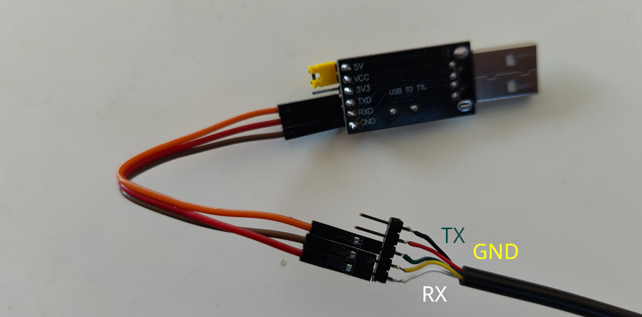

# Brightway Scooter Tuning Guide
This guide has been created by ScooterTeam.

## Quick Start Guide
1. Check if your scooter model is supported (see [Supported Models](#supported-models))
2. Read the [Safety Warning](#safety-warning) carefully
3. Get the required hardware (see [Hardware Requirements](#hardware-requirements))
4. Follow the step-by-step [Flashing Instructions](#flashing-instructions)

## Supported Models

| Model           | Tested OK |
|----------------|-----------|
| 3 Lite         | TBA       |
| 4              | TBA       |
| 4 Pro 2nd Gen  | ✅         |
| 5              | TBA       |
| 5 Max          | TBA       |
| 5 Pro          | ✅         |

> Note: If you own a model marked as TBA (To Be Announced), please be aware that the process hasn't been fully tested yet. You can help by testing and reporting your results.

## Safety Warning ⚠️
Before proceeding, please understand:

1. **Warranty**: This process will void your scooter's warranty
2. **Safety**: Incorrect modifications could affect your scooter's safety
3. **Legal**: Ensure your modifications comply with local laws
4. **Risk**: You are responsible for any damage or issues that may occur

> For complete legal information, please read the [Full Disclaimer](#full-disclaimer) at the bottom of this guide.

## Hardware Requirements

First, check which connector type you need for your scooter:

Model | Required Connector
-- | -- 
3 Lite | Male
4 | Male
4 Pro 2nd Gen | Female
5 | Female
5 Max | Male
5 Pro | Male

You have two options to get the required hardware. Choose whichever is more convenient for you:

### Option 1: Buy a Ready-to-Use Kit
This is the easiest option if you want everything in one package. Buy the appropriate kit:
- Female connector kit: [Link](https://www.ebay.de/itm/356681290474) or [Alternative](https://www.ebay.com/itm/116498080143)
- Male connector kit: [Link](https://www.ebay.de/itm/356888236112)

### Option 2: Buy Components Separately
This option gives you more flexibility and might be cheaper. You'll need to buy these components:

#### 1. USB-to-Serial (UART) Adapter
Choose one of these tested models:
- CH340
- FT232RL
- CP2102
- PL2303HX (not HXA!)

> ⚠️ Avoid PL2303HXA adapters - they have driver issues

#### 2. Dashboard Cable
You need a 5-pin Julet connector cable. Make sure to get the correct connector type (see table above).

> **Important**: Due to the tight pin spacing and small size of the dashboard connector, creating a DIY wiring solution is challenging and risks causing a short circuit between the pins.

You can find dashboard cables in local electronic stores or online (e.g., Aliexpress). Due to there being no standardized color for each pin, make sure your supplier lists which color cable connects to which pin. If not, you'll need to use a multimeter to check the pinout.

Example of different female dashboard cables from different sellers with different colors and pinouts:

#### 3. DuPont Wires (if needed)
If you have a dashboard breakout cable with male pin headers and a standard UART adapter (like the CH340 or FT232RL), you'll need:
- Female-to-female DuPont wires
- Minimum length: 40-80cm to reach the adapter without tension
- If you can't find female-to-female wires in that length, you can extend them with male-to-female sets

> **Note**: Some UART adapters come with an attached USB cable, which makes additional DuPont wires unnecessary.

### Hardware Connection Guide

#### Dashboard Cable Pinout
The standard pinout for the dashboard cable is:

Dashboard cable | Pinout
-- | --
White | RX
Yellow | GND
Green | TX
Red | 5V
Black | BTN

> **Note**: Wire colors may vary between different manufacturers. Always verify the pinout with a multimeter if unsure.

#### Connection Methods

1. **Direct Connection** (if UART adapter has attached cable):
   - Connect the dashboard cable directly to the UART adapter
   - Match the pinout according to the table above

Example of UART adapter with attached cable:

2. **Using DuPont Wires**:
   - Connect the dashboard cable to DuPont wires
   - Connect DuPont wires to the UART adapter
   - Ensure proper pinout matching

Example of UART adapter with DuPont wires:

> **Warning**: If you need to create a custom connection, consider these alternatives:
> - Use a regular 5-pin JST connector (like a spare hall sensor cable)
> - Pull out and replace pins in the original connector
> - Use the sewing needle method (requires careful handling)
> - Watch the [custom connector tutorial](https://www.youtube.com/watch?v=MEVXANRJ1IM)

## Flashing Instructions

### Step 1: Prepare Your Hardware
1. Connect the dashboard cable to your UART adapter
2. Connect your UART adapter to your computer
3. Note the COM port number (see [Finding COM Port](#finding-com-port))

### Step 2: Get the Software
1. Download [BwFlasher](https://github.com/scooterteam/bw-flasher/releases/latest)
2. Download your scooter's firmware:
   - Visit [mi-fw-info](https://mi-fw-info.streamlit.app)
   - Download the MCU firmware for your model
3. Patch the firmware:
   - Go to [bw-patcher](https://bw-patcher.streamlit.app)
   - Upload your firmware
   - Select your model and patches
   - Download the patched firmware

### Step 3: Flash Your Scooter
1. Open BwFlasher
2. Select your COM port
3. Choose your patched firmware file
4. Prepare your scooter:
   - Remove handlebar screws
   - Pull out the handlebar shaft
   - Turn ON the scooter
   - Unplug the dashboard cable
   - Connect your adapter cable
5. Click "Start Update" in BwFlasher
6. Wait for "Flashing complete" message

### Step 4: Reassemble
1. Remove adapter cable
2. Reconnect dashboard cable
3. Reinsert handlebar shaft
4. Tighten screws

## Troubleshooting

### Common Issues and Solutions

Problem | Solution
-- | --
Invalid Firmware File | Download the correct MCU firmware from mi-fw-info
Progress stuck at 5% or 45% | Try a different USB port or use a USB hub
Progress stuck at 0% | Try the steps listed below in order

### Steps to Fix "Progress stuck at 0%"
1. Restart BwFlasher and retry flashing
2. Make sure scooter is ON when starting update
3. Make sure have the latest driver installed for your UART adapter
4. Connect cables in this order:
   - Connect UART to PC
   - Turn ON scooter
   - Disconnect scooter cables
   - Connect UART cable to scooter
5. Check all cable connections are secure

## Additional Resources

### Dashboard Cable Pinout

### Finding COM Port
On Windows:
1. Open Device Manager
2. Look under "Ports (COM & LPT)"
3. Your UART adapter should appear with a COM port number

> Note: If you don't see your adapter, you may need to install drivers for your specific UART model.

## Full Disclaimer
This guide is provided with the following important notices:

- **Informational Purposes Only**: The content of this guide is for educational and informational purposes only. It is not intended to promote or endorse the modification of scooter firmware or hardware, nor does it guarantee the safety, functionality, or legality of any modifications.

- **Warranty Voidance**: Modifying the scooter's firmware or hardware, including using reverse-engineered tools, may void the manufacturer's warranty. Users should review their warranty terms before making any modifications.

- **Assumption of Risk**: Modifying scooter firmware or hardware can pose significant risks, including but not limited to voiding warranties, compromising safety, reducing functionality, or violating legal regulations. By following this guide, users assume full responsibility for any and all outcomes, including personal injury, property damage, or legal penalties.

- **Legal Compliance**: Users are solely responsible for ensuring that any modifications comply with applicable laws and regulations in their jurisdiction, including but not limited to those regarding speed limits, roadworthiness, and intellectual property.

- **No Liability**: The creators of this guide disclaim all liability for any direct, indirect, incidental, or consequential damages resulting from the use or misuse of the information or tools provided. By using this guide, users agree to release the authors from any legal claims or liabilities arising from their actions.
