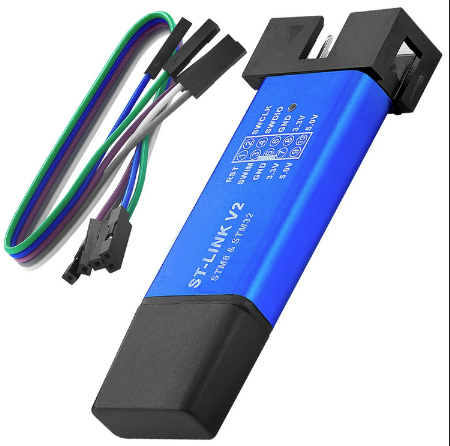

# F2 Tuning
## F2 ST-Link
You need to do this as a first step.

Required:
- ST Link V2, color doesnt matter  
  

- Male-Female dupont wires   
  

- Controller removed from your scooter with removed heatsink:  
  
  
  ⚠️ Unplug the battery wire first (big red and black cable with yellow connector). Then Press the dashboard button a few times.  
  After removing the black mosfet clamp, you can use a clamp to carefully push out the PCB from the heatsink.
  Alternatively, you can 3D-print and use the [ST-Link clip](https://www.printables.com/model/951959-ninebot-g2-st-link-clip) or you can slide piece of metal between the heatsink and the PCB, then drill a hole above the ST-Link pins - your PCB should be protected by the piece of metal you slid in. After you've drilled the hole, slide the metal out, and you should have access to the Pins.

1) Open the [Webflasher](https://flash.bastelpichi.de) in an chromium based webbrowser (Chrome, Edge, Opera, Chromium, etc.). Select F2 as Scooter, enter odometer value and SN.  
3) Connect your STLink with the jumpers according to the diagram, found by clicking on "Images" next to the scooter you selected. You will need to remove the heatsink from the board. Use the wires to match up the pins, so connect SWCLK to SWCLK, SWDIO to SWDIO, and so on. The names might be slightly different on the ST-Link (e.g. DIO instead of SWDIO, 3V3 instead of 3.3V). That doesnt matter. Its enough to hold the pins, no need to solder.  
    
4) Click "Start Flashing". If you are only holding the pins, you can press the "Start Countdown" button which will start the flashing 15 seconds after clicking on the button.  
5) If the ST-Link doesn't show up, follow the steps from the Help page, linked in the bottom.  
6) Watch the Segway Video in reverse. Congrats, your Scooter is now unrestricted, meaning you can flash any firmware you like via Bluetooth.  

## SHFW Guide
This works for the F2 Pro. You'll need to use an resistor instead of the motor NTC on the regular F2/F2 Plus.
1) Download [this file](https://firmware.scooterhacking.org/g2/BLE/1.11.0.zip).
2) Unzip it. Edit info.json, set enforceModel to false.  
  

4) Rezip the file. Make sure to not add any new folders. The files should be in the archive directly.
5) Flash the file via [SHU](https://utility.cfw.sh).
6) Your scooter will now identify as G2. Flash SHFW and configure away!
